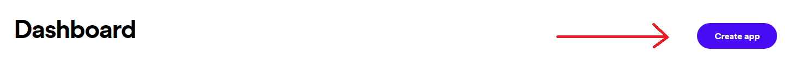
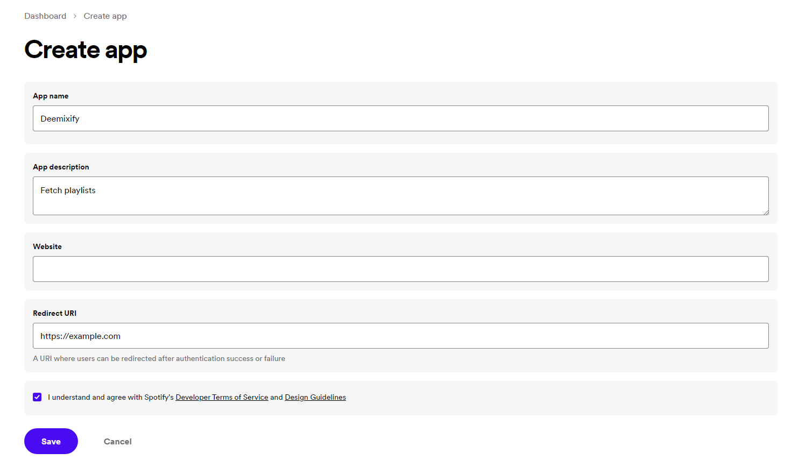
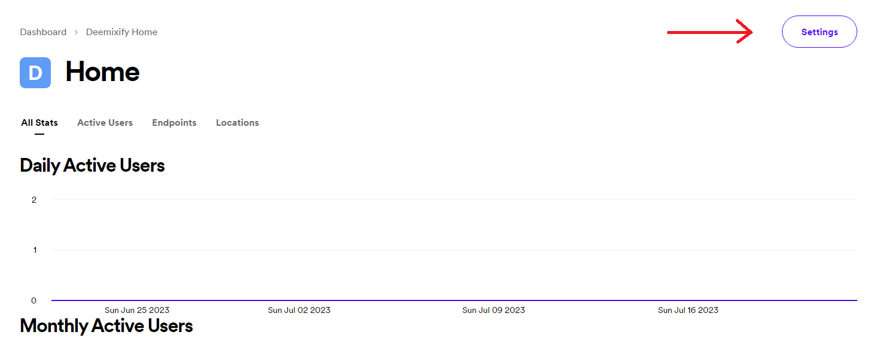

# Deemixify

Tool to fetch a users Spotify playlists and dowload them using deemix.

## Before running

- Make sure that deemix is installed through pip:  
  `pip install deemix`

- Configure deemix  
  The config files are located in the config folder, change `config.json` to your liking  
  This is where you will configure the download path and quality.

- Configure Spotify API

  1.  Make an app on https://developer.spotify.com/dashboard

      

  2.  Add `https://example.com` to the redirect URI

      

  3.  Click on settings, here you will find the `cliendID` and `cliendSecret`

      

  4.  Add `cliendID` and `cliendSecret` to `config.json` inside `/config/spotify/`

## Running the program

To run the program, go inside the folder `batch-files`. Here you can choose between 3 options:

1. `DownloadAndOrganize.bat`: download all your Spotify playlists and then organizes the playlist files in a seperate folder.
2. `DownloadPlaylists.bat`: download your Spotify playlists.
3. `OrganizePlaylists.bat`: organize playlist files, assumes you have already downloaded some music.

## Limitations

The tool may not work if the user has more than 50 playlists, as this is the limit of the Spotify API.

## TODO

Catch and log errors
